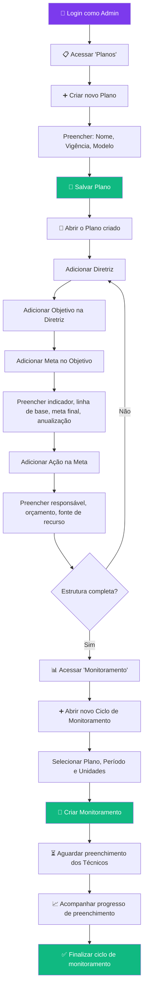
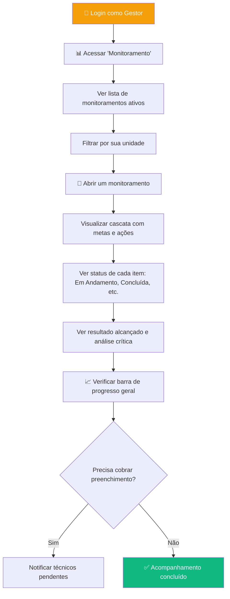
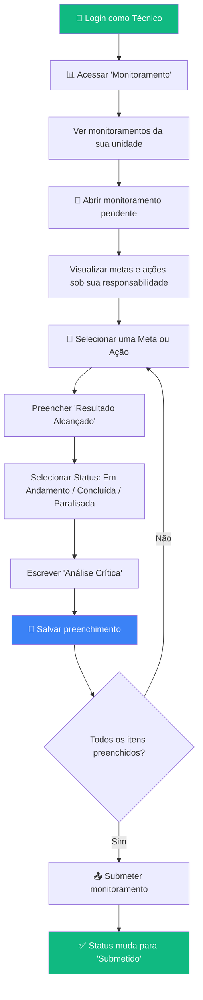

# 📘 Guia para Desenvolvedores — SIPLAN Módulo 2

> **Versão**: 1.0 | **Última atualização**: 25/03/2026
>
> Documento criado para ajudar devs novos (e atuais) a entender o que o sistema faz, como ele funciona por baixo dos panos, e como o planejamento está organizado.

---

## 1. O que é o SIPLAN?

O **SIPLAN** é um sistema web para a **Secretaria de Saúde (SESAP/RN)** gerenciar seus planos de saúde. Pense nele como uma "planilha turbinada" onde os gestores:

1. **Criam planos** (ex: PAS 2025, PES 2024-2027)
2. **Montam a estrutura** do plano em forma de árvore (Diretrizes → Objetivos → Metas → Ações)
3. **Monitoram** o andamento de cada item periodicamente (a cada quadrimestre ou trimestre)

Em resumo: **o sistema digitaliza todo o ciclo de planejamento em saúde**.

---

## 2. Estrutura Hierárquica — A "Cascata"

O coração do sistema é a **estrutura em cascata**. Todo plano segue esta hierarquia:

```
📁 Plano (PES ou PAS)
 └── 📋 Diretriz (orientação estratégica geral)
      └── 🎯 Objetivo (meta qualitativa)
           └── 📊 Meta (indicador mensurável com números)
                └── ⚙️ Ação (atividade concreta para atingir a meta)
```

### Exemplo real do sistema (PAS):

| Nível     | Exemplo                                                              |
|-----------|----------------------------------------------------------------------|
| Diretriz  | "Fortalecer a capacidade organizacional do sistema de saúde no RN"   |
| Objetivo  | "Promover a implantação da saúde digital e telessaúde"               |
| Meta      | "Adquirir 300 estações de trabalho por ano" (Linha de Base: 2446)    |
| Ação      | "Aquisição de 300 estações de trabalho — R$ 1.500.000,00"            |

### Diferenças PAS vs PPA

O sistema lida com campos dinâmicos dependendo do tipo de plano (`planType`):

- **PAS:** Tem 4 níveis e os dois primeiros são "simples" (só título e código). Só a Meta e a Ação recebem os campos complexos.
- **PPA:** Tem apenas 3 níveis (Objetivo Geral → Objetivo Específico → Entrega) e **todos os três** possuem os campos complexos (Indicador e Anualização).

> **Atenção**: Como a lógica varia, usamos a tabela `MODEL_FIELD_CONFIG` dentro de `utils/metaTypeConfig.ts` para dizer ao `ComponentForm.tsx` quais campos renderizar para cada nível de cada tipo de plano.

### Tipos de Meta: Patamar vs Acumulativa

Estas são regras de negócio importantes:

- **Patamar** (%, Taxa, Índice...): cada ano é independente. Ex: "Manter cobertura vacinal em 95%" — o 95% vale para cada ano.
- **Acumulativa** (Número, Unidades, R$...): os anos se somam. Ex: "Adquirir 1200 computadores em 4 anos" — 300 por ano = 1200 no total.

> A lógica está em `utils/metaTypeConfig.ts`. Se precisar adicionar uma nova unidade de medida, basta incluir na lista `MEASUREMENT_UNITS`.

---

## 3. Ciclo de Monitoramento

O monitoramento é o processo de **acompanhar se as metas e ações estão sendo cumpridas**. Funciona assim:

```
Admin abre um ciclo        →  Técnicos preenchem resultados  →  Ciclo é finalizado
(ex: "1º Quad. 2025")         para cada meta/ação                e vira histórico
```

### O que o técnico preenche para cada item:

| Campo              | O que é                                        | Exemplo                              |
|--------------------|------------------------------------------------|--------------------------------------|
| Resultado Alcançado| Número ou texto curto do que foi feito          | "76 impressoras contratadas"         |
| Status             | Estado atual da ação                           | EM ANDAMENTO, CONCLUÍDA, PARALISADA  |
| Análise Crítica    | Texto livre explicando o desempenho            | "Processo SEI nº 006... em tramitação" |

### Status possíveis de um monitoramento:
- `Não Preenchido` → acabou de ser criado
- `Em Preenchimento` → técnicos estão registrando dados
- `Submetido` → técnico finalizou o envio
- `Finalizado` → admin encerrou o ciclo

---

## 4. Perfis de Usuário

| Perfil     | O que pode fazer                                                                    |
|------------|-------------------------------------------------------------------------------------|
| **Admin**  | Tudo: criar planos, abrir monitoramentos, gerenciar estrutura, excluir registros     |
| **Gestor** | Visualizar planos, acompanhar monitoramentos da sua unidade                         |
| **Técnico**| Visualizar planos e preencher os dados de monitoramento das ações que é responsável  |

> No protótipo atual, há um seletor no topo da tela para simular a troca de papel.

---

## 5. Fluxogramas — Happy Path por Perfil

### 🔴 Administrador (Admin)

O Admin é quem monta tudo e acompanha o ciclo completo.



### 🟡 Gestor

O Gestor acompanha o andamento da sua unidade sem alterar a estrutura.



### 🟢 Técnico

O Técnico é quem coloca a mão na massa e preenche os dados reais.



---

## 6. Arquitetura Técnica (Visão Geral)

### Stack
- **React** + **TypeScript** + **Vite**
- **React Router** (HashRouter) para navegação
- **LocalStorage** como banco de dados (simulando um backend)
- **IndexedDB/localStorage** com delay simulado de 300ms

### Estrutura de Pastas

```
siplanmodulo2/
├── App.tsx                    ← Roteamento principal e estado global
├── types.ts                   ← TODOS os tipos/interfaces do sistema
├── components/
│   ├── CascadeView.tsx        ← Visualização em árvore do plano (componente principal)
│   ├── ComponentManager.tsx   ← CRUD de itens da hierarquia (Diretriz, Objetivo...)
│   ├── PlanForm.tsx           ← Formulário de criar/editar plano
│   ├── PlanCard.tsx           ← Card visual de cada plano na listagem
│   ├── ExecutionStatusModal.tsx ← Modal de status de execução
│   ├── MonitoringCascadeView.tsx ← Cascata específica para monitoramento
│   ├── ReportEditor.tsx       ← Editor de relatórios (RDQA/RAG)
│   ├── forms/                 ← Formulários específicos (ComponentForm, etc.)
│   ├── layout/                ← Sidebar, Header, MainLayout
│   └── ui/                    ← Componentes visuais reutilizáveis
├── pages/
│   ├── PlanList.tsx           ← Lista de todos os planos
│   ├── PlanDetail.tsx         ← Detalhe de um plano (com cascata)
│   ├── MonitoringList.tsx     ← Lista de monitoramentos
│   ├── MonitoringDetail.tsx   ← Detalhe de um monitoramento (preenchimento)
│   └── AdminPanel.tsx         ← Painel administrativo
├── services/
│   └── database.ts            ← "Banco de dados" (localStorage + dados seed)
├── hooks/
│   └── useApplicationData.ts  ← Hook central que gerencia estado (plans + monitorings)
├── context/
│   └── ToastContext.tsx        ← Notificações toast do sistema
├── utils/
│   └── metaTypeConfig.ts      ← Config de tipos de meta (patamar/acumulativa)
└── data/
    └── budgetData.ts           ← Dados orçamentários de referência
```

---

## 7. Fluxo de Dados

O fluxo é simples e centralizado:

```
App.tsx
  └── useApplicationData()        ← hook que carrega tudo do "banco"
       ├── plans[]                  ← lista de PESInstance
       └── monitorings[]           ← lista de MonitoringInstance
            │
            ├── createPlan()
            ├── updatePlan()        ← atualização otimista (muda na tela antes de salvar)
            ├── deletePlan()
            ├── createMonitoring()
            ├── updateMonitoring()
            └── deleteMonitoring()
                │
                └── db.plans / db.monitorings   ← services/database.ts (localStorage)
```

### Pontos importantes:
- **Atualizações otimistas**: o estado na tela muda primeiro, depois salva no localStorage. Se falhar, o usuário pode não perceber.
- **Campos Dinâmicos (PAS/PPA)**: O formulário de cadastro (`ComponentForm.tsx`) não usa checks fixos por `ComponentType`. Ele recebe um objeto `fieldConfig` do `ComponentManager`, que por sua vez obtém a configuração pelo arquivo `utils/metaTypeConfig.ts` (função `getFieldConfig`). É lá que a regra de negócio de "quem tem indicador", "quem tem orçamento", etc. está documentada.
- **Dados seed**: na primeira vez que o sistema abre, ele carrega dados de exemplo (PAS 2025 com dados reais da UGTIC).
- **Sem backend real**: tudo é localStorage. Quando for integrar com API, basta trocar as funções em `services/database.ts`.

---

## 8. Rotas da Aplicação

| Rota               | Página               | Quem acessa          |
|---------------------|-----------------------|----------------------|
| `/`                 | Redireciona para `/monitorings` | Todos       |
| `/plans`            | Lista de planos       | Apenas Admin         |
| `/plan/:id`         | Detalhe do plano      | Apenas Admin         |
| `/monitorings`      | Lista de monitoramentos | Todos              |
| `/monitoring/:id`   | Detalhe/preenchimento | Todos                |
| `/admin`            | Painel administrativo | Apenas Admin         |

---

## 9. Planejamento de Sprints

O desenvolvimento foi organizado em **3 sprints**, cada uma com um foco:

### Sprint 1 — Fundação ✅
> Objetivo: montar a base e permitir criar/gerenciar planos.

- ✅ CRUD de Planos de Saúde
- ✅ Layout com Sidebar e navegação
- ✅ Cadastro de Diretrizes e Objetivos

### Sprint 2 — Hierarquia Completa ✅
> Objetivo: completar a árvore (Metas/Ações) e visualização em cascata.

- ✅ Gestão de Metas com indicadores e anualização
- ✅ Gestão de Ações com orçamento e responsáveis
- ✅ Componente CascadeView (árvore expansível com cores por nível)

### Sprint 3 — Monitoramento e Controle ✅
> Objetivo: implementar o ciclo de monitoramento e controle de acesso.

- ✅ Criação de ciclos de monitoramento
- ✅ Preenchimento de resultados pelos técnicos
- ✅ Controle de papéis (Admin/Gestor/Técnico)

### Próximos Passos (Backlog)
- [ ] Exportação de relatórios em PDF
- [ ] Integração com backend real (API REST)
- [ ] Nomenclatura dinâmica do PPA (permitir customizar rótulos dos níveis)
- [ ] Frequência de monitoramento configurável (Trimestral vs Quadrimestral)
- [ ] Dashboard com gráficos de progresso

---

## 10. Como Rodar o Projeto

```bash
# 1. Instalar dependências
npm install

# 2. Rodar em modo desenvolvimento
npm run dev

# 3. Acessar no navegador
# http://localhost:5173
```

### Deploy (GitHub Pages)
```bash
npm run deploy
```

---

## 11. Conceitos Importantes para Novos Devs

| Termo                  | Significado                                                        |
|------------------------|--------------------------------------------------------------------|
| **PES**                | Plano Estadual de Saúde (plano de 4 anos)                         |
| **PAS**                | Programação Anual de Saúde (plano de 1 ano, derivado do PES)      |
| **PPA**                | Plano Plurianual (plano governamental de 4 anos)                  |
| **Linha de Base**      | Valor atual do indicador antes de começar as ações                 |
| **Meta Final**         | Valor que se quer alcançar ao final do período                     |
| **Anualização**        | Dividir a meta total em valores para cada ano                      |
| **Quadrimestre**       | Período de 4 meses (Jan-Abr, Mai-Ago, Set-Dez)                   |
| **RDQA**               | Relatório Detalhado do Quadrimestre Anterior                       |
| **RAG**                | Relatório Anual de Gestão                                          |
| **Cascade View**       | Visualização em árvore que mostra toda a hierarquia expandível     |
| **Seed Data**          | Dados de exemplo que o sistema carrega na primeira vez              |

---

> 💡 **Dica final**: Se está perdido, comece olhando `types.ts` para entender os dados, depois `App.tsx` para entender as rotas, e por fim `useApplicationData.ts` para entender como tudo se conecta.
